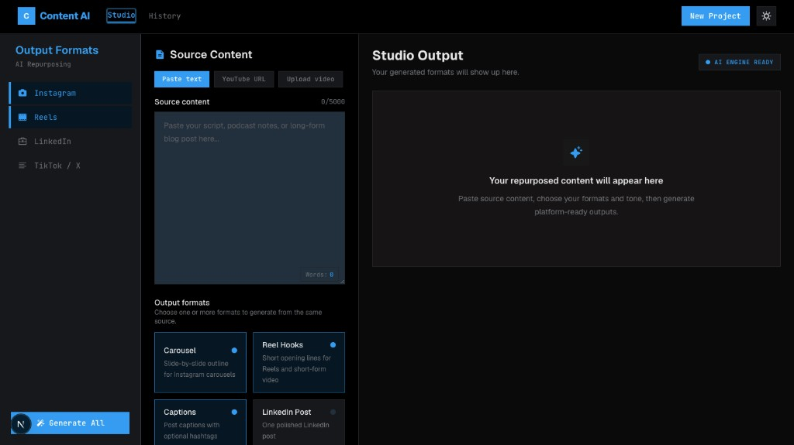

# Content AI

Creator-focused AI repurposing studio built with **Next.js**, **Cloudflare Workers**, **Workers AI**, and **D1**.

Turn one source into platform-ready outputs:

- Instagram carousel outlines
- Reel hooks
- Post captions
- Optional LinkedIn post or X thread



## Stack

- Next.js App Router (TypeScript)
- Tailwind CSS
- `@opennextjs/cloudflare` for Workers deployment
- Cloudflare Workers AI (`@cf/meta/llama-3.3-70b-instruct-fp8-fast`)
- Cloudflare D1 for generation history
- localStorage for browser-side restore of the last generation

## Getting started

### Prerequisites

- Node.js 22+
- A Cloudflare account
- Wrangler 4+

### Install

```bash
npm install
```

### Local development

```bash
npm run dev
```

Open [http://localhost:3000](http://localhost:3000).

If Cloudflare bindings are unavailable locally (for example on unsupported macOS versions for the Workers runtime), the app falls back to structured mock generation so the UI and API flow still work.

### Preview on Workers runtime

```bash
npm run preview
```

Requires a machine that can run the Cloudflare Workers runtime.

### Deploy

```bash
npm run deploy
```

## Cloudflare setup

1. Log in to Cloudflare:

```bash
npx wrangler login
```

2. Create the D1 database:

```bash
npx wrangler d1 create content-ai-db
```

3. Update `wrangler.jsonc` with the returned `database_id`.

4. Apply the schema:

```bash
npm run db:migrate:local
npm run db:migrate:remote
```

5. Generate binding types:

```bash
npm run cf-typegen
```

## Project structure

```text
src/
  app/
    page.tsx                 # Landing page
    studio/page.tsx          # Main generation UI
    history/page.tsx         # Saved generations
    api/generate/route.ts    # Generation endpoint
    api/history/route.ts     # History endpoint
  components/                # UI components
  lib/
    ai.ts                    # Workers AI calls + local fallback
    prompts.ts               # Prompt templates
    validators.ts            # Request validation
    formatters.ts            # Response parsing/formatting
    storage.ts               # localStorage helpers
    db.ts                    # D1 helpers
db/
  schema.sql                 # D1 schema
```

## API

### `POST /api/generate`

Request:

```json
{
  "sourceContent": "Paste source content here",
  "formats": ["carousel", "hooks", "caption"],
  "tone": "casual",
  "ctaStyle": "soft"
}
```

Response:

```json
{
  "success": true,
  "results": {
    "carousel": { "slides": ["Slide 1...", "Slide 2..."] },
    "hooks": { "items": ["Hook 1...", "Hook 2..."] },
    "caption": {
      "variants": [
        { "text": "Caption A...", "hashtags": ["#creator", "#content"] }
      ]
    }
  },
  "generationId": "optional-d1-id"
}
```

## MVP scope

Included:

- Landing page and studio workflow
- Structured AI generation for multiple formats
- Copy actions and local restore
- Optional D1-backed history page

Not included in v1:

- Authentication
- Payments / credits
- URL/audio/video ingestion
- Collaboration and review workflows
